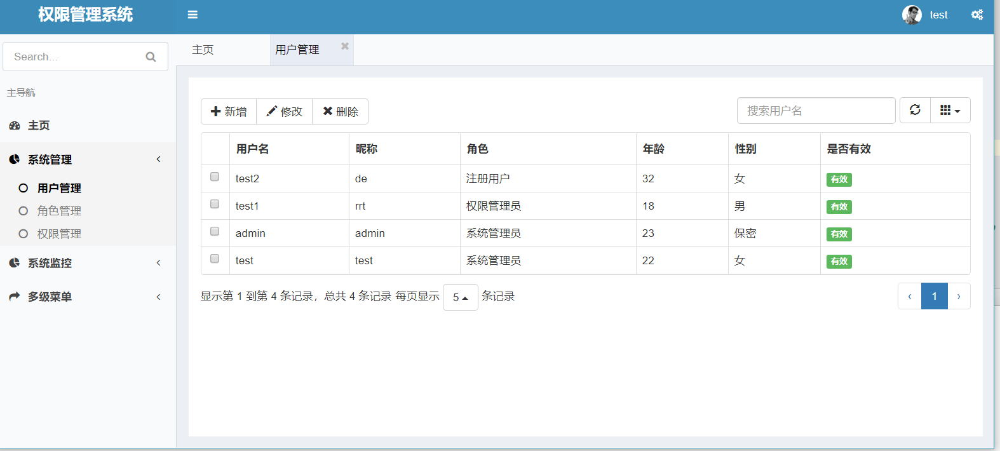
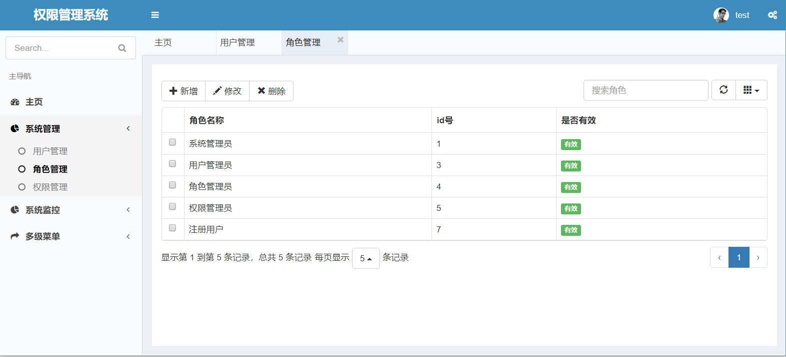
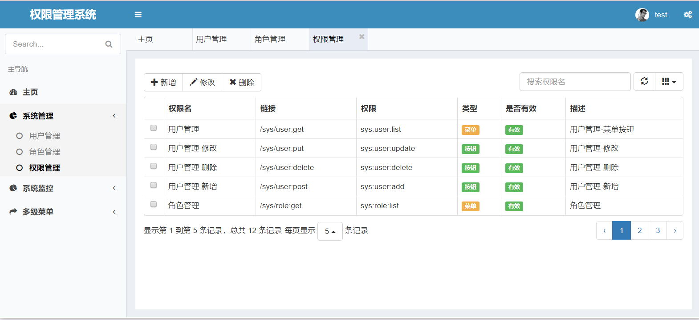
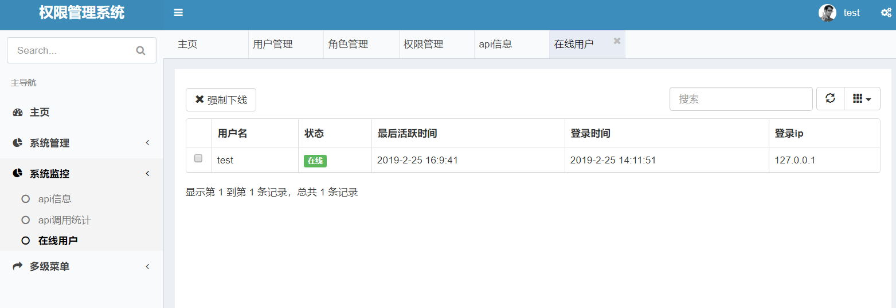

# 基于springboot的权限管理系统

# 功能概要
- RBAC权限管理
- 接口限流
- 日志切面
- 集中式会话管理

# 技术概览

### 后端
- 基础框架：Spring Boot 2

- 持久层框架：Mybatis

- 安全框架：Apache Shiro

- 摸板引擎：Thymeleaf

- 数据库连接池：阿里巴巴Druid

- 缓存框架：Redis

- 日志打印：logback

- 其他：fastjson，poi，javacsv，quartz等。

### 前端
 
- 基础框架：Bootstrap 3

- JavaScript框架：jQuery

- 消息组件：Toaster

- 树形插件：jsTree

- 表格插件：BootstrapTable

### 开发环境

- 语言：Java 8

- IDE：IDEA

- 依赖管理：Maven

- 数据库：MySQL

- 版本管理：git

### 预览

